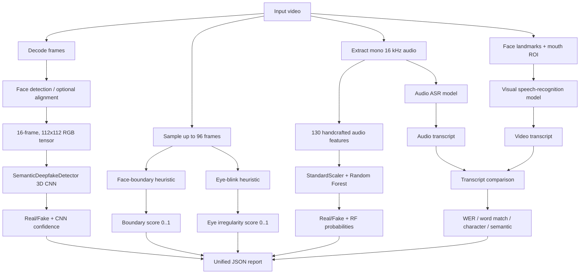

# GradCAM3D Project: Complete Working Guide

This document explains the current project as it exists in this repository. It
covers the data flow, active source files, model architectures, training,
inference, explainability, audio Random Forest, transcript comparison, weak
labels, checkpoints, and the unified JSON analysis command.

## 1. What the project does

The project analyzes a video using several independent signals:

1. A semantic 3D CNN classifies the visual clip as **Real (0)** or **Fake (1)**.
2. Visual heuristics estimate face-boundary inconsistency and eye-blink
   irregularity.
3. A Random Forest classifies handcrafted features extracted from the audio.
4. An audio speech-recognition model generates an audio transcript.
5. A visual speech-recognition model reads the speaker's lips and generates a
   video transcript.
6. The two transcripts are compared using WER, word match, character
   similarity, and semantic similarity.
7. The unified runner writes all available results into one JSON file.

These signals are reported separately. The current code does **not** combine
them into a final ensemble score.

## 2. End-to-end flow



## 3. Important folders and active files

```text
analysis/
  analyze_video.py          Unified multi-model JSON runner

cnn/
  model.py                  Active 3D CNN and semantic attention model
  video_dataset.py          Active video loading and preprocessing
  train.py                  Active CNN training command
  inference.py              Active CNN prediction command
  generate_weak_labels.py   Eye and boundary heuristic generation
  gradcam.py                Standard 3D Grad-CAM++
  headwise_gradcam.py       Per-attention-head Grad-CAM++
  shap_explain.py           SHAP command-line entry point
  explainability/           Head-wise Grad-CAM and SHAP helpers
  configs/config.py         CNN defaults and project paths
  weights/                  OpenCV face-detector files

random_forest/
  extract_features.py       Audio extraction and feature calculation
  train.py                  Random Forest training and evaluation
  predict_video.py          Single-video Random Forest prediction
  preprocess.py             Optional WAV preprocessing
  split_dataset.py          Metadata CSV split utility
  models/                   Fitted scaler and Random Forest files

transcript/
  infer.py                  Audio/video transcript entry point
  pipelines/pipeline.py     Transcript preprocessing + model wrapper
  pipelines/model.py        ESPnet model and beam-search decoder
  pipelines/data/           Audio and video loading/transforms
  pipelines/detectors/      MediaPipe and RetinaFace mouth tracking
  metrics/                  WER, character, and semantic metrics
  configs/                  Audio/video model configuration files
  benchmarks/LRS3/models/   Large pretrained speech checkpoints

data_tools/
  prepare_dataset.py        Prepare balanced CNN train/val/test splits
  split_fakeavceleb.py      FakeAVCeleb metadata and split utility

data/                       CNN train/validation/test videos
weak_labels/                Generated semantic weak labels
checkpoints/                CNN training checkpoints
outputs/                    JSON and explanation outputs
small_data/                 Small example videos
trial.py                    Repack an extracted PyTorch checkpoint as .pth
```

### Active code versus older scaffold code

The main CNN scripts import `cnn/model.py` and `cnn/video_dataset.py`. The
folders `cnn/models/`, `cnn/datasets/`, `cnn/engine/`, and `cnn/utils/` contain
older or incomplete scaffold modules and are not the primary path used by
`cnn/train.py`, `cnn/inference.py`, or `analysis/analyze_video.py`.

## 4. Label convention

The convention is consistent across the active CNN and Random Forest paths:

| Class | Numeric label |
|---|---:|
| Real | 0 |
| Fake | 1 |

For the CNN, softmax index 0 is Real and index 1 is Fake. For the Random Forest,
`predict_proba(...)[0][1]` is the Fake probability.

## 5. Dataset preparation

### Required CNN structure

```text
data/
  train/
    real/
    fake/
  val/
    real/
    fake/
  test/
    real/
    fake/
```

Supported video types are MP4, AVI, MOV, MKV, and WEBM.

`data_tools/prepare_dataset.py`:

- scans one or more raw source directories;
- determines Real/Fake labels from their paths;
- balances the classes by downsampling the larger class;
- creates stratified train, validation, and test splits;
- copies files by default, or moves them with `--move`;
- writes a CSV split manifest;
- rebuilds existing `train`, `val`, and `test` output folders.

Example:

```powershell
python data_tools\prepare_dataset.py --sources "C:\datasets\Celeb-DF" --output-dir data
```

The FakeAVCeleb-specific utility creates grouped/stratified metadata and copies
videos into split folders while attempting to prevent identity leakage.

## 6. CNN video preprocessing

The active preprocessing is in `cnn/video_dataset.py`.

### Frame decoding

OpenCV decodes every video frame. Frames are converted from BGR to RGB. A video
with no readable frames raises an error.

### Clip selection

- Training uses a random contiguous 16-frame clip.
- Validation and inference use a deterministic center 16-frame clip.
- A video shorter than 16 frames is padded by repeating its last frame.

### Face processing

The face detector prefers RetinaFace when available. Otherwise, it uses the
included OpenCV Res10 SSD face detector. If no face is found, the full frame is
used so inference can still continue.

The detected face is expanded with an 18% margin and resized to 112 x 112.

Optional `--align-faces` processing uses MediaPipe eye landmarks to rotate the
frame until the eye line is horizontal. Training and inference must use the same
alignment choice for consistent inputs.

### Normalization and augmentation

Pixels are converted to floating point and divided by 255, then normalized with
ImageNet RGB mean and standard deviation.

Training applies clip-consistent augmentation:

- horizontal flip with 50% probability;
- contrast from 0.9 to 1.1 and brightness shift from -0.12 to 0.12 with 80%
  probability;
- Gaussian noise with standard deviation 0.015 with 30% probability.

All frames in a clip receive the same sampled augmentation settings.

The final sample tensor has shape:

```text
(channels, time, height, width) = (3, 16, 112, 112)
```

The DataLoader adds a batch dimension:

```text
(batch, channels, time, height, width)
```

## 7. Semantic 3D CNN architecture

The active model is `SemanticDeepfakeDetector` in `cnn/model.py`.

### 7.1 Convolutional backbone

For a standard input `(B, 3, 16, 112, 112)`:

| Stage | Operation | Approximate output |
|---|---|---|
| Input | RGB video clip | `(B, 3, 16, 112, 112)` |
| Block 1 | 3D Conv 3→24, BN, ReLU, MaxPool | `(B, 24, 8, 56, 56)` |
| Block 2 | Residual block, Conv 24→48, MaxPool | `(B, 48, 4, 28, 28)` |
| Block 3 | Residual block, Conv 48→96, MaxPool | `(B, 96, 2, 14, 14)` |
| Final | Conv 96→128, BN, ReLU | `(B, 128, 2, 14, 14)` |

Each residual block contains two 3D convolutions and adds the input identity
before the final ReLU.

### 7.2 Spatiotemporal attention

The final feature volume is flattened into time-space tokens. With the default
shape, the model has `2 x 14 x 14 = 392` tokens. A learned Q/K/V projection
applies four-head scaled dot-product attention.

The 128 channels are divided into four heads of 32 channels each. The result is
a per-head feature volume. Spatial and temporal averaging produces four head
vectors of width 32.

### 7.3 Learned head fusion

`HeadWeightedFusion` contains one learned scalar per head. Softmax turns these
scalars into normalized weights. The weighted sum produces one fused 32-value
feature vector.

### 7.4 Semantic concepts

The fused vector passes through:

```text
32 -> 64 -> 2 concept logits -> sigmoid concept scores
```

The two configured concepts are:

1. `boundary_inconsistency`
2. `eye_blink_irregularity`

These scores form an interpretable concept bottleneck.

### 7.5 Final classification

The model has two classification paths:

- a direct visual classifier from the fused attention vector;
- a semantic classifier from the two concept values.

The final logits are:

```text
final_logits = visual_logits + sigmoid(semantic_logit_gate) * semantic_logits
```

The gate starts at `sigmoid(-2)`, approximately 0.119. This makes the visual
branch dominant initially while still allowing semantic concepts to contribute.

Softmax over the two final logits produces Real/Fake probabilities.

## 8. CNN training

The entry point is `cnn/train.py`.

### Default settings

| Setting | Default |
|---|---:|
| Epochs | 20 |
| Batch size | 16 |
| Learning rate | 0.0001 |
| Weight decay | 0.00001 |
| Optimizer | Adam |
| Clip length | 16 |
| Image size | 112 |
| Label smoothing | 0.05 |
| Random seed | 42 |
| Scheduler | ReduceLROnPlateau |
| Scheduler patience | 4 |
| Scheduler factor | 0.5 |

Without weak labels, training minimizes smoothed cross-entropy on Real/Fake.

With `--weak-label-dir`, the model returns its semantic intermediate values and
uses:

```text
total loss = classification cross-entropy + 0.3 * concept binary cross-entropy
```

Validation uses the center clip and standard cross-entropy. The best validation
accuracy checkpoint is saved.

### Pretrained checkpoints

`--pretrained-backbone-path` is a warm start. It loads only keys that exist in
the current model and have matching tensor shapes. It supports:

- a raw state dictionary;
- a dictionary containing `model_state_dict`;
- a dictionary containing `state_dict`;
- checkpoints saved with a `module.` prefix.

This option does **not** resume the previous optimizer, scheduler, epoch number,
or best validation score. A new Adam optimizer is created.

Example:

```powershell
python cnn\train.py --device cuda --epochs 1 --pretrained-backbone-path best_model_2.pth --checkpoint-path checkpoints\best_model_2_epoch1.pth --num-workers 0
```

### Checkpoint contents

The training checkpoint contains:

- epoch number;
- model state dictionary;
- optimizer state dictionary;
- scheduler state dictionary when enabled;
- validation accuracy;
- Real/Fake class mapping;
- architecture name;
- concept vocabulary;
- concept loss weight.

## 9. CNN inference

`cnn/inference.py` builds the semantic model, loads compatible weights, reads a
center clip, applies the same face preprocessing, and runs the model in
evaluation mode without gradients.

It returns:

- predicted label (`Real` or `Fake`);
- confidence of the predicted class.

Confidence is the largest softmax probability, not always the Fake
probability.

```powershell
python cnn\inference.py "video.mp4" --checkpoint-path checkpoints\best_model.pth --device cuda
```

## 10. Weak-label heuristics

`cnn/generate_weak_labels.py` generates two values in the range 0 to 1. Higher
values mean stronger suspected inconsistency, not a calibrated probability of
deepfake.

### 10.1 Eye-blink irregularity

The preferred backend is MediaPipe Face Mesh. It calculates the eye aspect
ratio (EAR) from six landmarks per eye.

The score considers:

- deviation from an expected blink rate of about 18 blinks/minute;
- variation in EAR;
- closures longer than 0.6 seconds;
- absence of blinks in clips lasting at least four seconds.

The weighted score is:

```text
0.45 * blink-rate penalty
+ 0.25 * EAR variability
+ 0.20 * long-closure penalty
+ 0.10 * no-blink penalty
```

If MediaPipe is unavailable, an OpenCV eye detector estimates missing-eye
transitions, missing ratio, eye-box geometry variation, and geometry jitter.
Insufficient observations return a neutral fallback score of 0.5.

### 10.2 Face-boundary inconsistency

The boundary heuristic creates elliptical regions inside and around the
detected face. For each usable frame it measures:

- Laplacian edge energy in a face-boundary ring relative to the inner face;
- LAB color difference between the inner face and outer ring.

The per-frame score is:

```text
0.7 * boundary edge-ratio score + 0.3 * color-difference score
```

The video's result is the median of frame scores. If no face can be measured,
the fallback is 0.5.

### Generated weak-label files

For each video, the generator can write:

```text
<video>_weak_labels.json
<video>_weak_labels.npy
<video>_ff_label.json
```

The fixed vector order is boundary inconsistency first, eye-blink irregularity
second.

## 11. CNN explainability

### Standard 3D Grad-CAM++

`cnn/gradcam.py` hooks the selected convolution layer, normally `final_conv`.
It differentiates the selected class score with respect to the 3D activations,
uses second- and third-order gradient terms to calculate Grad-CAM++ weights,
applies ReLU, resizes the heat volume, and overlays it on video frames.

```powershell
python cnn\gradcam.py "video.mp4" --checkpoint-path checkpoints\best_model.pth --output-path outputs\gradcam.mp4 --device cuda
```

### Head-wise Grad-CAM++

`cnn/headwise_gradcam.py` calculates a separate Grad-CAM++ map for every
semantic attention head. It produces a grid containing the input frame and the
four head overlays. The configured head names are generic (`head_1` through
`head_4`); they are not guaranteed to learn a fixed human meaning.

### SHAP

SHAP uses `shap.GradientExplainer` with a small set of background clips sampled
evenly from a dataset folder. It can explain:

- a Real/Fake class logit or score;
- one semantic concept logit or score.

Absolute RGB contributions can be aggregated into a magnitude volume. Signed
visualization uses red for evidence supporting the target and blue for evidence
opposing it. SHAP is substantially slower and more memory-intensive than
Grad-CAM.

## 12. Random Forest audio branch

The Random Forest branch analyzes audio rather than video pixels.

### Audio extraction

FFmpeg extracts mono audio at 16 kHz from the input video. Librosa also loads
the signal as mono 16 kHz audio.

### Feature vector

For time-varying features, both temporal mean and standard deviation are used:

| Feature group | Values |
|---|---:|
| 40 MFCCs: mean + standard deviation | 80 |
| 12 chroma bins: mean + standard deviation | 24 |
| 7 spectral-contrast bands: mean + standard deviation | 14 |
| Spectral centroid | 2 |
| Spectral bandwidth | 2 |
| Spectral roll-off | 2 |
| Spectral flatness | 2 |
| RMS energy | 2 |
| Zero-crossing rate | 2 |
| **Total** | **130** |

### Training

`random_forest/train.py` reads train, validation, and test feature CSVs. It
removes the metadata columns `label`, `generator`, and `filename`, fits a
StandardScaler on training data, and trains:

```text
RandomForestClassifier(
    n_estimators=300,
    max_depth=None,
    random_state=42,
    n_jobs=-1
)
```

It reports accuracy, precision, recall, F1, ROC AUC, confusion matrix, and a
classification report. It saves:

```text
random_forest/models/scaler.pkl
random_forest/models/random_forest.pkl
random_forest/results/random_forest_results.csv
```

### Prediction

The predictor extracts the same 130 features, applies the saved scaler, then
returns the predicted label and Fake probability. The unified runner also
calculates Real probability as `1 - fake_probability`.

## 13. Transcript comparison branch

The transcript subsystem is based on pretrained ESPnet-style LRS3 audio and
visual speech-recognition models.

Because configuration paths are relative, direct transcript commands should be
run from inside `transcript/`. The unified runner handles the working directory
automatically.

### 13.1 Audio transcript

For a video input, PyAV decodes the audio stream, converts it to mono 16 kHz,
and writes a temporary WAV. The configured audio ASR model generates the audio
transcript.

### 13.2 Video transcript

OpenCV reads RGB frames. MediaPipe or RetinaFace supplies face landmarks. The
video processing pipeline tracks/crops the mouth region, applies the configured
video transform, and sends it to the visual speech-recognition model.

### 13.3 Speech model and decoding

The model loads its architecture configuration from JSON and tensor weights
from the LRS3 checkpoint. It uses an ESPnet end-to-end Transformer/CTC model.
Batch beam search decodes the highest-scoring token sequence. Current configs
use beam size 40, CTC weight 0.1, no external language model, and no length
penalty.

The audio model is run and released before the video model is loaded. This
reduces peak RAM and GPU memory.

### 13.4 Transcript metrics

The audio transcript is treated as the reference and the lip-read transcript
as the hypothesis.

#### Word Error Rate

WER is computed with JiWER. The implementation clamps WER to at most 1.0 even
though mathematical WER can exceed 1.0 when insertions are numerous.

```text
word match (%) = (1 - clamped WER) * 100
```

#### Character similarity

Python's case-insensitive `SequenceMatcher` ratio is multiplied by 100.

#### Semantic similarity

Sentence Transformer `all-MiniLM-L6-v2` embeds both transcripts. Cosine
similarity is multiplied by 100. The first use may need the model to already be
cached or may require network access to download it.

## 14. Unified JSON analysis

`analysis/analyze_video.py` is the main all-in-one command.

```powershell
python analysis\analyze_video.py "video.mp4" --checkpoint best_model_2.pth --device cuda --transcript-gpu-index -1
```

The runner executes these stages in order:

1. `cnn_3d`
2. `weak_label_heuristics`
3. `random_forest`
4. `transcript_comparison`

CNN memory is released before later stages. Transcript inference runs in a
child process so its large models are fully released when the process ends.

Each stage is independent. If one stage fails, the runner records its exception
under `errors`, continues the other stages, and still writes JSON. The report
status is:

- `complete` when every stage succeeds;
- `partial` when one or more stages fail.

Use `--strict` when a partial report should also cause a non-zero command exit
code.

### JSON structure

```json
{
  "schema_version": 1,
  "generated_at_utc": "...",
  "input_video": "...",
  "label_encoding": {"REAL": 0, "FAKE": 1},
  "results": {
    "cnn_3d": {
      "label": "FAKE",
      "label_id": 1,
      "confidence": 0.81,
      "device": "cuda",
      "checkpoint": "..."
    },
    "weak_label_heuristics": {
      "boundary_inconsistency": 0.42,
      "eye_blink_irregularity": 0.07,
      "score_range": [0.0, 1.0]
    },
    "random_forest": {
      "label": "FAKE",
      "label_id": 1,
      "confidence": 0.72,
      "fake_probability": 0.72,
      "real_probability": 0.28
    },
    "transcript_comparison": {
      "audio_transcript": "...",
      "video_transcript": "...",
      "wer": 0.2,
      "word_match_rate": 80.0,
      "character_similarity": 84.5,
      "semantic_similarity": 91.2
    }
  },
  "errors": {},
  "status": "complete"
}
```

The default output is:

```text
outputs/full_analysis_<video-stem>.json
```

## 15. Checkpoint conversion with trial.py

A PyTorch `.pth` file is internally a ZIP-based container. If it has been
extracted into a directory such as `best_model_2/`, `torch.load()` cannot load
the directory directly.

`trial.py` repacks the directory with the archive layout PyTorch expects:

```powershell
python trial.py --overwrite
```

The default input is `best_model_2/` and the output is `best_model_2.pth`.

## 16. Common commands

### Train the CNN

```powershell
python cnn\train.py --device cuda --num-workers 0
```

### Train one epoch from existing weights on another dataset

```powershell
python cnn\train.py --device cuda --epochs 1 --pretrained-backbone-path best_model_2.pth --train-dir "C:\dataset\train" --val-dir "C:\dataset\val" --checkpoint-path checkpoints\new_dataset_epoch1.pth --num-workers 0
```

### CNN-only prediction

```powershell
python cnn\inference.py "video.mp4" --checkpoint-path best_model_2.pth --device cuda
```

### Unified analysis

```powershell
python analysis\analyze_video.py "video.mp4" --checkpoint best_model_2.pth --device cuda --transcript-gpu-index -1
```

### Generate weak labels

```powershell
python cnn\generate_weak_labels.py --input-root data\train --weak-label-dir weak_labels\train
```

### Train and run the Random Forest

```powershell
python random_forest\train.py
python random_forest\predict_video.py "video.mp4"
```

## 17. Important current limitations

1. The unified analysis runner reports separate evidence sources. The optional
   `Rule_Based_Fusion_Module` converts them into a four-way video/audio verdict:
   real/real, real/fake, fake/real, or fake/fake.
2. CNN inference uses one center 16-frame clip, so evidence elsewhere in a long
   video may be missed.
3. CNN confidence and Random Forest probabilities are not explicitly
   calibrated.
4. Weak heuristic values are handcrafted anomaly scores, not probabilities.
5. Transcript comparison assumes the video's audio content and visible lip
   motion should represent the same speech.
6. WER is capped at 1.0 by this implementation.
7. Visual speech recognition requires a visible speaking face and works poorly
   with profile views, occlusion, low resolution, or little mouth motion.
8. Semantic similarity may require a cached Sentence Transformer model.
9. `--pretrained-backbone-path` does not resume optimizer state.
10. In the current source, `SemanticDeepfakeDetector.compute_loss()` references
    `Config.LABEL_SMOOTHING` without importing `Config` in `cnn/model.py`. Normal
    classification training is unaffected, but weak-label training can raise a
    `NameError` until that import/reference is corrected.

## 18. How to interpret the outputs

No single score proves that a video is fake.

- A high CNN Fake confidence means the learned visual patterns resemble the
  Fake training class.
- A high boundary score means the detected face border has stronger edge/color
  discontinuity according to the heuristic.
- A high eye score means blink behavior appears irregular according to the
  heuristic.
- A high Random Forest Fake probability means the audio features resemble the
  Fake audio training distribution.
- High WER and low transcript similarities mean audio speech and visible lip
  speech disagree.

The most useful interpretation is agreement across independent branches, while
also checking whether poor video/audio quality could explain the anomaly.
